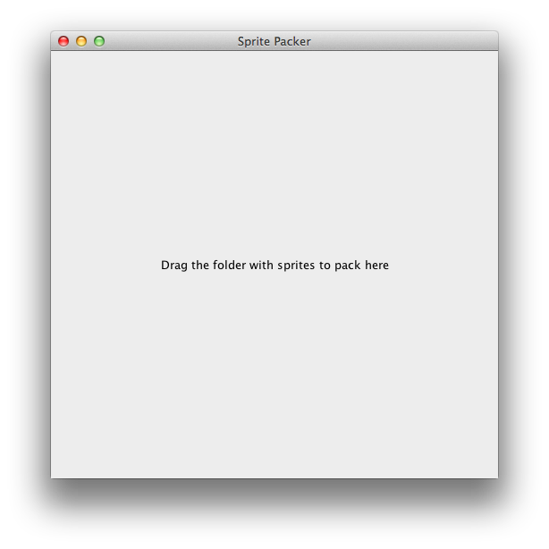

texturepackerhelper
===================

Simple GUI Tool for LibGDX's TexturePacker2 

Double-click target/texturepackerhelper-0.1.0-SNAPSHOT-standalone.jar and drag folder with sprites into window. 
Calls TexturePacker2 to create pack and atlas files. 

Drag & Drop based on FileDrop (http://www.iharder.net/current/java/filedrop/). 
